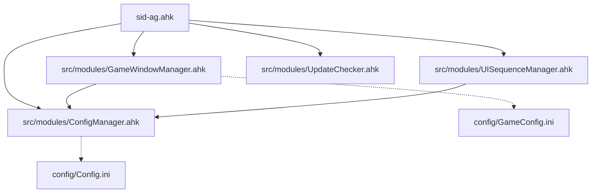

# AHK 模組功能詳細說明

本文檔詳細介紹深空之眼腳本中每個 AutoHotkey 模組的功能、架構和使用方法。

## 📁 模組總覽

| 檔案名稱 | 功能分類 | 行數 | 依賴關係 |
|----------|----------|------|----------|
| `sid-ag.ahk` | 主程式 | ~900+ | 所有模組 |
| `src/modules/ConfigManager.ahk` | 配置管理 | ~300 | 無 |
| `src/modules/GameWindowManager.ahk` | 視窗管理 | ~190 | ConfigManager |
| `src/modules/UISequenceManager.ahk` | UI動畫 | ~400 | 無 |
| `src/modules/UpdateChecker.ahk` | 更新檢查 | ~110 | 無 |

---

## 🔧 核心模組詳解

### 1. `sid-ag.ahk` - 主程式核心

#### 🎯 核心功能

- **戰鬥自動化核心**：實現完整的戰鬥邏輯和技能發送
- **角色專屬模式**：支援魂羽、緋染、巧构、庚辰等多角色專屬技能邏輯
- **熱鍵管理**：處理所有用戶輸入和快捷鍵
- **狀態監控**：即時監控遊戲狀態和用戶操作
- **手動介入偵測**：智能識別用戶手動操作並自動暫停

#### 🏗️ 架構特點

```ahk
; 模組載入順序
#Include src\modules\GameWindowManager.ahk    ; 視窗管理優先
#Include src\modules\ConfigManager.ahk        ; 配置管理
#Include src\modules\UpdateChecker.ahk        ; 更新檢查
#Include src\modules\UISequenceManager.ahk    ; UI動畫
```

#### ⚡ 核心函數

- `CombatLoop()` - 戰鬥循環核心，每30ms執行一次
- `CheckHunYuSkills()` - 魂羽角色專屬技能檢查
- `CheckFeiRanSkills()` - 緋染角色專屬技能檢查
- `CheckQiaoGouSkills()` - 巧构角色專屬技能檢查
- `CheckGengChenSkills()` - 庚辰角色專屬技能檢查

#### 🎮 支援角色

| 角色 | 技能邏輯 | 特殊機制 |
|------|----------|----------|
| **通用模式** | R > F > Q > E 優先級 | 顏色像素偵測 |
| **魂羽** | F判定1/2 + E判定 | 圖片識別 + 左鍵連擊 |
| **緋染** | Q/Q1 + E/E1 + F/F_End | 多階段連段邏輯 |
| **巧构** | Q-E-Q-E 強化輪替 | 能量判定 + 強化技能 |
| **庚辰** | Q→右鍵→E→F | 怒氣判定 + 固定連段 |

---

### 2. `src/modules/ConfigManager.ahk` - 配置管理器

#### 🎯 配置管理功能

- **INI文件管理**：統一讀寫配置檔案
- **類型安全**：支援字串、整數、布林值的類型安全讀取
- **預設值處理**：自動建立預設配置
- **動態載入**：運行時動態載入和保存配置

#### 📋 配置區段

```ini
[Script]
Version=1.0.4
Name=sid-ag

[Game]
WindowTitle= AetherGazer
ColorVariation=15
ImageVariation=80

[UI]
ShowStartupGUI=true
StatusDisplayX=10

[Hotkeys]
AutoAttack=F1
Pause=F4
CharacterSelect=F5
```

#### 🛠️ 核心方法

- `GetConfig(section, key, default)` - 讀取配置值
- `SetConfig(section, key, value)` - 設定配置值
- `SaveConfig()` - 保存所有配置到檔案
- `CreateDefaultConfig()` - 建立預設配置

#### 🔒 安全特性

- **檔案存在檢查**：自動建立缺失的配置文件
- **類型轉換**：安全的字串到數值轉換
- **異常處理**：完善的錯誤處理機制

---

### 3. `src/modules/GameWindowManager.ahk` - 遊戲視窗管理器

#### 🎯 視窗管理功能

- **視窗調整**：自動調整遊戲視窗到指定大小和位置
- **進程監控**：即時監控遊戲進程的啟動和結束
- **條件熱鍵**：智能F2熱鍵，僅在遊戲視窗活躍時生效
- **回調機制**：支援遊戲啟動/結束的事件回調

#### ⚙️ 配置參數

```ini
[Game]
ProcessName=AetherGazer.exe
WindowTitle= AetherGazer

[Window]
TargetWidth=1600
TargetHeight=900
CenterWindow=true
```

#### 🔄 工作流程

1. **初始化**：載入配置，註冊熱鍵
2. **進程監控**：每3秒檢查遊戲進程狀態
3. **視窗調整**：F2熱鍵觸發視窗調整邏輯
4. **事件回調**：遊戲啟動/結束時觸發相應事件

#### 🎯 熱鍵行為

- **遊戲視窗活躍**：執行視窗調整
- **其他視窗活躍**：保持系統原生F2功能

---

### 4. `src/modules/UISequenceManager.ahk` - UI序列管理器

#### 🎯 UI動畫功能

- **啟動動畫**：管理腳本啟動時的UI顯示順序
- **漸層效果**：實現文字和圖形的淡入淡出效果
- **進度指示**：顯示系統檢查的進度條
- **倒計時提醒**：F2功能使用提醒

#### 🎬 UI序列流程

```text
環境檢查 → 啟動畫面 → F2提醒 → 腳本啟動
    ↓         ↓         ↓        ↓
  進度條    淡入效果  倒計時   自動關閉
```

#### ✨ 動態效果

- **文字淡入**：平滑的透明度變化
- **進度條動畫**：逐步填充的視覺效果
- **閃爍提醒**：重要訊息的閃爍效果
- **自動關閉**：定時自動隱藏UI元素

#### 🎨 視覺設計

- **深色主題**：現代化的深色UI設計
- **透明效果**：半透明的視窗效果
- **動態文字**：即時更新的狀態文字
- **居中佈局**：螢幕居中的精確定位

---

### 5. `src/modules/UpdateChecker.ahk` - 更新檢查器

#### 🎯 更新檢查功能

- **GitHub API整合**：從GitHub獲取最新版本資訊
- **版本比較**：智能比較版本號大小
- **下載連結**：自動生成下載頁面連結
- **靜默檢查**：支援背景自動檢查

#### 🌐 API整合

```ahk
API端點: https://api.github.com/repos/{user}/{repo}/releases/latest
請求方法: GET (同步)
超時設定: 5秒連接, 10秒總超時
```

#### 📊 版本比較邏輯

- **語意化版本**：支援 x.y.z 格式版本號
- **數字比較**：正確處理版本號的數值比較
- **忽略v字首**：自動處理 v1.0.0 格式

#### 🔄 檢查模式

- **靜默檢查**：背景檢查，不顯示UI
- **互動檢查**：顯示檢查結果和更新提示
- **手動觸發**：F7熱鍵手動檢查更新

#### ⚠️ 錯誤處理

- **網路異常**：優雅處理連接失敗
- **API限制**：處理GitHub API速率限制
- **JSON解析**：安全的JSON回應解析

---

## 🔗 模組依賴關係



## 📊 效能指標

| 模組 | 平均執行時間 | 記憶體使用 | CPU使用率 |
|------|-------------|-----------|-----------|
| ConfigManager | <1ms | ~50KB | <0.1% |
| GameWindowManager | ~5ms | ~30KB | <0.5% |
| UISequenceManager | ~10ms | ~100KB | <1% |
| UpdateChecker | ~200ms | ~20KB | <2% |
| sid-ag主循環 | ~15ms | ~200KB | 1-5% |

## 🛠️ 開發與維護

### 程式碼規範

- **AutoHotkey v2.0** 語法標準
- **物件導向設計**：使用類別封裝功能
- **錯誤處理**：完善的異常捕獲機制
- **註釋規範**：詳細的函數和變數註釋

### 測試建議

- **單元測試**：各模組獨立功能測試
- **整合測試**：模組間互動測試
- **效能測試**：記憶體和CPU使用率監控
- **相容性測試**：不同系統環境測試

### 擴展指南

- **模組化設計**：便於新增功能模組
- **配置驅動**：通過INI文件調整行為
- **事件驅動**：支援回調機制擴展
- **API友好**：清晰的介面設計

---

## 📝 更新日誌

### v1.0.4 (最新)

- ✨ 新增庚辰角色支援
- 🎨 優化UI序列動畫效果
- 🔧 改進配置管理安全性
- 📦 完善模組化架構

### v1.0.3

- 🎮 新增角色選擇系統
- 🖥️ 完善視窗管理功能
- 🔄 優化更新檢查機制

### v1.0.2

- 🎯 實現戰鬥自動化核心
- ⚙️ 新增配置管理系統
- 🎨 設計UI動畫效果

---

## 📄 維護資訊

本文檔由 Sid 維護，如有問題請透過 GitHub Issues 反饋
