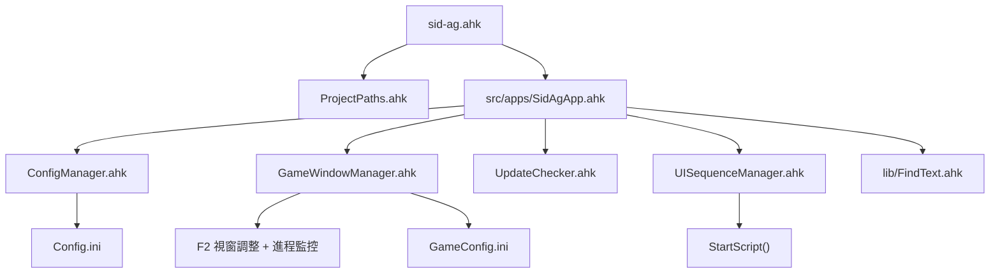

# AetherGazer AHK 技術文件

這份文件是專案後續維護的主入口。目標不是再寫一份使用說明，而是把目前專案的架構、依賴、啟動流程、FindText 整合方式、配置來源、以及擴充規則一次整理清楚，讓後續開發能直接沿著既有規則做。

## 1. 專案定位

這個專案是 AutoHotkey v2 的深空之眼半自動腳本，核心目標有四個：

1. 依照遊戲視窗與配置自動執行技能判定與輸入。
2. 用 FindText 取代部分圖像判定，提升複雜 UI 下的辨識穩定度。
3. 透過模組化結構把配置、視窗、UI、更新檢查拆開，降低主程式耦合。
4. 讓 EXE 與原始碼版本都能透過相同的路徑規則運作。

## 2. 目前檔案結構

```text
/
├── sid-ag.ahk
├── src/
│   ├── ProjectPaths.ahk
│   ├── apps/
│   │   ├── SidAgApp.ahk
│   │   └── CoordinateAdjustmentApp.ahk
│   └── modules/
│       ├── ConfigManager.ahk
│       ├── GameWindowManager.ahk
│       ├── UISequenceManager.ahk
│       └── UpdateChecker.ahk
├── lib/
│   └── FindText.ahk
├── config/
│   ├── Config.ini
│   ├── GameConfig.ini
│   └── coordinates_config.json
├── assets/
│   ├── common/
│   └── characters/
└── docs/
    ├── USER_GUIDE.md
    └── CoordinateAdjustmentTool_README.md
```

## 3. 啟動鏈

主入口不是 `src/apps/SidAgApp.ahk`，而是根目錄的 `sid-ag.ahk`。它負責把執行環境切到正確位置，然後載入真正的應用程式。



## 4. 路徑與環境

### `src/ProjectPaths.ahk`

這個檔案是全專案的路徑基礎。

- 編譯後執行時，`PROJECT_ROOT` 直接取腳本所在資料夾。
- 開發時，`PROJECT_ROOT` 會依據 `A_LineFile` 判斷目前是從 `src/` 還是根目錄載入。
- 之後所有路徑都由這些全域變數派生：
  - `SRC_DIR`
  - `MODULE_DIR`
  - `CONFIG_DIR`
  - `ASSETS_DIR`
  - `COMMON_ASSETS_DIR`
  - `CHARACTER_ASSETS_DIR`
  - `DOCS_DIR`
  - `RELEASES_DIR`

### 路徑 helper

- `GetProjectPath(relativePath := "")`
- `GetConfigPath(fileName := "")`
- `GetAssetPath(relativePath := "")`
- `GetCommonAssetPath(fileName := "")`
- `GetCharacterAssetPath(characterName, fileName := "")`

這些 helper 的價值在於：

1. 開發版與發布版共用同一套路徑規則。
2. 角色資源可以按資料夾拆分，不需要在主程式寫死絕對路徑。
3. `CoordinateAdjustmentApp.ahk`、`SidAgApp.ahk`、`GameWindowManager.ahk` 都能用一致的方式取得檔案。

## 5. 模組責任邊界

### `src/modules/ConfigManager.ahk`

負責 `Config.ini` 的建立、讀取、更新與保存。

核心行為：

- 啟動時自動讀取設定。
- 缺檔時自動建立預設 INI。
- 提供 `Get()`、`Set()`、`SaveConfig()`、`GetUpdateOptions()`。
- 提供 `InitializeConfig()`、`GetConfig()`、`SetConfig()` 這些便捷函式給主程式使用。

可讀取的主要區段：

- `Script`
- `UpdateChecker`
- `Game`
- `UI`
- `Hotkeys`

### `src/modules/GameWindowManager.ahk`

負責遊戲視窗與進程層面的事情。

核心行為：

- 讀取 `GameConfig.ini`。
- 每 3 秒檢查遊戲進程。
- 遊戲視窗活躍時，攔截 `F2` 並執行視窗調整。
- 遊戲關閉時觸發回調，並可延遲自動結束腳本。
- 提供座標轉換 helper，給 FindText 搜尋用。

可用函式：

- `InitializeGameManager(configFilePath := "")`
- `LoadGameConfig()`
- `AdjustGameWindow(*)`
- `CheckGameProcess()`
- `SetGameExitCallback(callback)`
- `SetGameStartCallback(callback)`
- `GetGameConfig(key)`
- `ReloadGameConfig()`
- `IsGameRunning()`
- `WindowToScreen(winX, winY)`
- `ScreenToWindow(screenX, screenY)`

### `src/modules/UISequenceManager.ahk`

負責啟動時的儀式感 UI 流程。

主要階段：

1. 環境檢查。
2. 啟動畫面淡入。
3. F2 提醒。
4. 完成後呼叫 `StartScript()`。

這個模組的重點不是功能本身，而是把啟動體驗和啟動順序從主程式拆出去，避免 `SidAgApp.ahk` 變成一坨難維護的視窗程式碼。

### `src/modules/UpdateChecker.ahk`

負責 GitHub Releases 更新檢查。

核心流程：

1. 用 `WinHttp.WinHttpRequest.5.1` 同步請求 GitHub API。
2. 解析 `tag_name` 作為最新版本。
3. 以 `_IsNewer()` 比對當前版本。
4. 若有新版本，建立提示視窗並顯示更新內容。

### `lib/FindText.ahk`

這是外部函式庫，不屬於 `src/modules`，但它已經是主系統的一部分。

它的作用是把截圖內容轉成文字編碼，再用文字編碼去做搜尋。這比單純的 `ImageSearch` 更適合處理某些細節清楚但容易受色差影響的 UI 元素。

## 6. 主程式責任

### `src/apps/SidAgApp.ahk`

這是實際執行戰鬥判定與按鍵輸出的主程式。

啟動時做的事情：

1. 設定 `CoordMode("Pixel", "Window")`、`SendMode("Input")`、延遲參數。
2. 載入 `GameWindowManager`、`ConfigManager`、`UpdateChecker`、`UISequenceManager`、`FindText`。
3. 初始化配置。
4. 檢查管理員權限。
5. 檢查桌面與腳本環境。
6. 讀取版本、技能冷卻、視覺閾值等配置。
7. 初始化遊戲管理器與更新檢查。
8. 依設定決定是否先跑啟動 UI，再進入 `StartScript()`。

### 主要全域狀態

這個檔案有大量全域變數，維護時要特別小心，不要隨意改名。

常見類別如下：

- 腳本狀態：`isScriptPaused`、`isAutoAttack`、`isCastingSkill`、`isBBQMode`、`isInCombat`
- 角色狀態：`CurrentCharacter`、`CharacterList`、`CurrentCharacterIndex`
- 輸入監控：`IsManualIntervention`、`LastUserInputTime`、`EnableInputDebug`
- GUI 狀態：`IsStatusGUICreated`、`IsHelpGUICreated`、`IsCentralStatusGUICreated`
- 時間控制：`LastSkillTime`、`LastHotkeyPress`

## 7. 主流程

### `CheckSystemEnvironment()`

這裡不再放重的邏輯，只保留一個分流：

- `ShowStartupGUI = true` 時，呼叫 `StartUISequence()`。
- 否則直接 `StartScript()`。

### `StartScript()`

啟動真正的常駐循環與 UI：

- `CombatDetection` 每 500 ms 檢查一次。
- `CombatLoop` 每 30 ms 執行一次。
- 若啟用狀態列，就更新 `UpdateStatusDisplay()`。
- 也會更新中央狀態 `UpdateCentralStatusDisplay()`。
- 註冊輸入監控 `RegisterInputHooks()`。
- 啟動手動介入檢測 `CheckManualIntervention()`。
- 延遲顯示 `CreateHelpGUI()`。

### 戰鬥流程

`CombatLoop()` 的核心邏輯大致是：

1. 先檢查模式旗標與視窗焦點。
2. 如果角色有專屬模式，優先走角色專用判定。
3. 否則走通用技能優先級。
4. 依技能狀態與 cooldown 決定是否送出按鍵。
5. 如果允許普攻，則在條件滿足時送出滑鼠點擊。

### 角色專屬邏輯

- `魂羽`：以 FindText 判定特定技能狀態，再搭配左鍵連擊或按鍵輸出。
- `緋染`：已全面用 FindText 條件檢查關鍵 UI；其中 `F` 仍保留 ImageSearch fallback。
- `巧构`：先判定能量，再走 `Q/E` 的強化連段。
- `庚辰`：先用像素判定怒氣，再用 FindText 確認狀態，最後執行固定連段。
- `武羅`：已加入 `Q1/Q2/E1/E2/F` 的 FindText 檢查與輸入鏈。
- `詩蔻蒂`：已加入 `E1/F1/F2/F3/F4` 判定與週期性 `Q` 輸入。
- `赤音`：目前仍是待開發狀態，角色選單中有，但功能未完整接上。

## 8. FindText 整合規則

### 函式本體

`lib/FindText.ahk` 提供的主入口是：

```ahk
FindText(&OutputX:="", &OutputY:=""
  , x1:=0, y1:=0, x2:=0, y2:=0, err1:=0, err0:=0, text:=""
  , ScreenShot:=1, FindAll:=1, JoinText:=0, offsetX:=20, offsetY:=10
  , dir:=0, zoomW:=1, zoomH:=1)
```

另外，`FindText()` 不帶參數時會回傳預設物件，這是 library 提供的物件式用法入口。

### 本專案的固定規則

這個專案不是直接把 ImageSearch 換成 FindText 就結束，而是有一套固定流程：

1. 原本若是視窗座標，先透過 `WindowToScreen()` 轉成螢幕座標。
2. FindText 搜尋範圍一律用轉換後的螢幕座標。
3. 將 FindText 回傳的輸出座標，用於後續 UI 或動作定位。
4. 若單一技能有 fallback，優先保留，避免完全依賴一種辨識法。

### 典型呼叫形態

```ahk
screenCoords := WindowToScreen(x1, y1)
screenCoords2 := WindowToScreen(x2, y2)

if (FindText(&fx, &fy
    , screenCoords.x, screenCoords.y
    , screenCoords2.x, screenCoords2.y
    , 0.1, 0.1
    , SomeSkillText)) {
    ; 命中後執行輸入
}
```

### 參數理解

- `x1, y1, x2, y2`：搜尋範圍。
- `err1, err0`：允許的誤差範圍。
- `text`：FindText 編碼字串。
- `ScreenShot`：搜尋前是否重新截圖。
- `FindAll`：是否找全部結果。
- `JoinText`：是否把多段文字合併再找。
- `offsetX, offsetY`：圖樣偏移容忍。
- `dir`：搜尋方向。
- `zoomW, zoomH`：縮放倍率。

### 特殊等待模式

`FindText.ahk` 本身支援 `wait` / `wait0` 風格的等待模式。也就是說，若輸出座標變數使用特定字串，函式可變成等待出現或等待消失的模式。這是 library 層的能力，不是本專案額外封裝出來的。

## 9. 配置文件對照表

### `config/Config.ini`

這是主設定檔。

#### `Script`

- `Version`
- `Name`

#### `UpdateChecker`

- `GitHubUser`
- `GitHubRepo`
- `CheckOnStart`
- `SilentCheck`
- `AutoUpdate`
- `TimeoutSeconds`
- `CheckInterval`

#### `Game`

- `WindowTitle`
- `WindowWidth`
- `WindowHeight`
- `SkillCooldown`
- `SkillLockTime`
- `ColorVariation`
- `ImageVariation`

#### `UI`

- `StatusDisplayX`
- `StatusDisplayY`
- `ShowStartupGUI`
- `ShowStatusOverlay`

#### `Hotkeys`

- `AutoAttack`
- `WindowResize`
- `Help`
- `Pause`
- `CharacterSelect`
- `BBQMode`
- `CheckUpdate`
- `Reload`
- `Exit`

### `config/GameConfig.ini`

這是視窗與進程調整設定。

#### `Game`

- `ProcessName`
- `WindowTitle`

#### `Window`

- `TargetWidth`
- `TargetHeight`
- `CenterWindow`

#### `Process`

- `AutoExitDelay`
- `CheckInterval`
- `ShowExitMessage`

## 10. 角色與資源規則

### 命名方式

角色資源透過 `GetCharacterAssetPath(characterName, fileName)` 取得，資料夾結構要跟角色名稱一致。

例如：

- `assets/characters/緋染/`
- `assets/characters/巧构/`
- `assets/characters/庚辰/`
- `assets/characters/魂羽/`

### 新增角色時應該做的事

1. 先準備角色圖片或 FindText 字串。
2. 把資源放進對應角色資料夾。
3. 在 `SidAgApp.ahk` 增加角色判定邏輯。
4. 必要時在 `Config.ini` 增加新的閾值或切換選項。
5. 如果角色需要特殊視窗座標，先確認 `WindowToScreen()` 的轉換仍適用。

## 11. UI 與操作體驗

### 啟動 UI

`UISequenceManager.ahk` 的啟動 UI 不是純裝飾，它實際上用來：

- 讓使用者知道環境檢查正在跑。
- 提醒桌面解析度與 DPI 是否符合需求。
- 提醒 F2 的視窗調整功能。

### 狀態顯示

主程式提供兩種狀態視覺化：

- 左上角小型 overlay：顯示腳本狀態、戰鬥狀態、當前動作、模式、普攻與角色。
- 中央大字提示：顯示目前是戰鬥、自動、手動介入、還是小遊戲模式。

### 幫助面板

`CreateHelpGUI()` 會顯示熱鍵說明與外部連結。這個視窗是常駐輔助工具，不應和戰鬥循環互相綁死。

## 12. 維護與擴充規則

### 不要做的事

1. 不要在主程式裡再塞新的路徑拼接邏輯。
2. 不要繞過 `ConfigManager` 直接用硬編碼 INI 常數。
3. 不要在多個地方重複寫同一個 FindText 座標轉換。
4. 不要把角色專屬邏輯塞進通用模式分支。
5. 不要讓 GUI 初始化和戰鬥判定混在同一個函式裡。

### 建議做法

1. 新設定先進 `ConfigManager`，再讓主程式讀取。
2. 新視窗行為先收進 `GameWindowManager`。
3. 新 UI 流程優先放 `UISequenceManager`。
4. FindText 搜尋一定先轉座標，再寫條件。
5. 新角色先做一條完整判定鏈，再考慮重構共用函式。

## 13. 常見問題與排查順序

### `#Include` 找不到檔案

先確認是不是從錯的入口啟動。

- 發布版應該從根目錄的 `sid-ag.ahk` 啟動。
- 開發版應該保留 `src/`、`lib/`、`config/` 的相對位置。
- 如果只搬了單一檔案，`ProjectPaths.ahk` 的推導就會失效。

### FindText 無法命中

排查順序：

1. 確認 `lib/FindText.ahk` 存在且已被 include。
2. 確認搜尋範圍是螢幕座標，不是視窗座標。
3. 確認遊戲視窗標題與 `WindowTitle` 一致。
4. 確認桌面解析度與 DPI 符合預期。
5. 如果是緋染 F 技能，確認 fallback 的 ImageSearch 資源也存在。

### F2 沒反應

`GameWindowManager` 會用 `~F2` 保留系統原生功能。只有當遊戲視窗活躍時才會執行視窗調整；否則它不應該吃掉原本的 F2。

### 更新檢查沒結果

確認 `Config.ini` 的 `UpdateChecker` 區段是否有正確的 GitHub 使用者與倉庫名稱。若 `silent` 模式開啟，沒有更新時本來就不會跳提示。

## 14. 建議的後續整理方向

如果後續要繼續重構，建議順序是：

1. 先把 `SidAgApp.ahk` 的角色邏輯拆成更小的角色模組。
2. 再把共用狀態整理成較少的全域來源。
3. 最後再補完整的單一職責文件和測試用說明。

這樣做的原因很簡單：現在最穩的邊界已經存在，先沿著這些邊界整理，比一次大搬家風險低很多。
